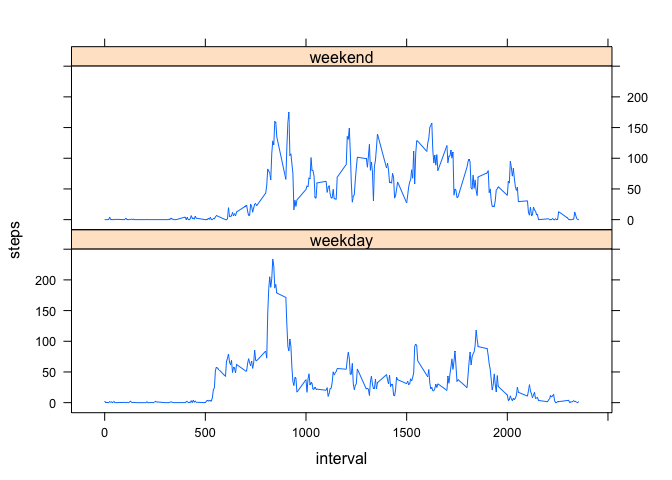

# Reproducible Research: Peer Assessment 1


## Loading and preprocessing the data

Unzip and read csv into dataframe.


```r
activity.data <- read.csv(unz("activity.zip","activity.csv"),colClasses = c("numeric","Date","numeric"))
summary(activity.data)
```

```
##      steps            date               interval   
##  Min.   :  0.0   Min.   :2012-10-01   Min.   :   0  
##  1st Qu.:  0.0   1st Qu.:2012-10-16   1st Qu.: 589  
##  Median :  0.0   Median :2012-10-31   Median :1178  
##  Mean   : 37.4   Mean   :2012-10-31   Mean   :1178  
##  3rd Qu.: 12.0   3rd Qu.:2012-11-15   3rd Qu.:1766  
##  Max.   :806.0   Max.   :2012-11-30   Max.   :2355  
##  NA's   :2304
```


## What is mean total number of steps taken per day?

Compute new dataframe with columns for date and total steps for all intervals for that date.


```r
daily.steps <- aggregate(steps ~ date,activity.data,sum)
steps <- daily.steps$steps
hist(steps)
```

 

Steps stats. Only median and mean were requested.


```r
summary(steps,digits=7)[3:4]
```

```
## Median   Mean 
##  10765  10766
```


## What is the average daily activity pattern?

Make a time series plot of the 5-minute interval and the average number of steps taken, averaged across all days.


```r
interval.steps <- aggregate(steps ~ interval,activity.data,mean)
plot(interval.steps,type = "l")
```

 

Which 5-minute interval, on average across all the days in the dataset, contains the maximum number of steps?  
This is the interval number corresponding to the value on the x-axis under the peak number of steps.


```r
interval.steps[which.max(interval.steps$steps),"interval"]
```

```
## [1] 835
```


## Inputing missing values

Number of missing values (total number of rows with NAs).


```r
# compute index locations where NAs occur in the input dataframe
steps.na <- which(is.na(activity.data$steps))
length(steps.na)
```

```
## [1] 2304
```

Replace each NA with mean over all days for that interval.


```r
# create a column  that has the index of the mean for interval for that observation
activity.data$meanindex = match(activity.data$interval,interval.steps$interval)

# create a column that has the mean for interval of that observation 
activity.data$im2 <- interval.steps[activity.data$meanindex,"steps"]

# copy steps column to steps.adj
activity.data$steps.adj <- activity.data$steps

# replace NA with means for that intervaal
activity.data$steps.adj[steps.na] = activity.data$im2[steps.na]

daily.steps.adj <- aggregate(steps.adj ~ date,activity.data,sum)
steps.adj <- daily.steps.adj$steps.adj
hist(steps.adj)
```

 

Repeat stats with adjusted steps (missing values substituted)


```r
daily.steps.adj <- aggregate(steps.adj ~ date,activity.data,sum)
steps.adj <- daily.steps.adj$steps.adj
```

Steps stats after adjusting for NAs. Only median and mean were requested.


```r
summary(steps.adj,digits=7)[3:4]
```

```
## Median   Mean 
##  10766  10766
```

So there is *no appreciable difference* after adjusting for NAs by substituting mean for the interval.

## Are there differences in activity patterns between weekdays and weekends?

Create a new factor variable "day.type" in dataset activity.data with two levels -- "weekday" and "weekend" indicating whether a given date is a weekday or weekend day.


```r
# setup for panel plot
library(lattice)

# for debugging, add column to show day of week for each observation
activity.data$weekday = weekdays(activity.data$date)

# add the new factor
activity.data$day.type = as.factor(ifelse(
        weekdays(activity.data$date) == "Saturday" |
                weekdays(activity.data$date) == "Sunday","weekend","weekday"))


# compute interval averages over both day types, weekday and weekend
interval.weekday.steps <- aggregate(steps ~ interval,activity.data[activity.data$day.type == "weekday",],mean)
interval.weekend.steps <- aggregate(steps ~ interval,activity.data[activity.data$day.type == "weekend",],mean)

# create a single "lean format" dataframe with interval averages for weekdays and weekends

interval.weekday.steps$day.type <- "weekday"
interval.weekend.steps$day.type <- "weekend"

combined <- rbind(interval.weekday.steps,interval.weekend.steps)
combined <- transform(combined, day.type = factor(day.type))

# show the panel plot
xyplot(steps ~ interval | day.type, data = combined, layout = c(1,2),type = "l")
```

 

It appears *there is a difference* in activity patterns for weekdays vs. weekends.

